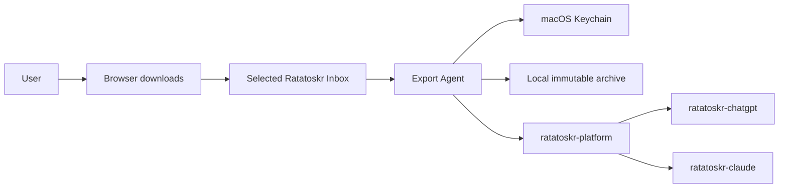
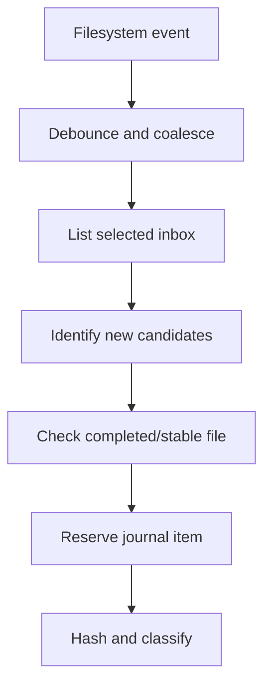
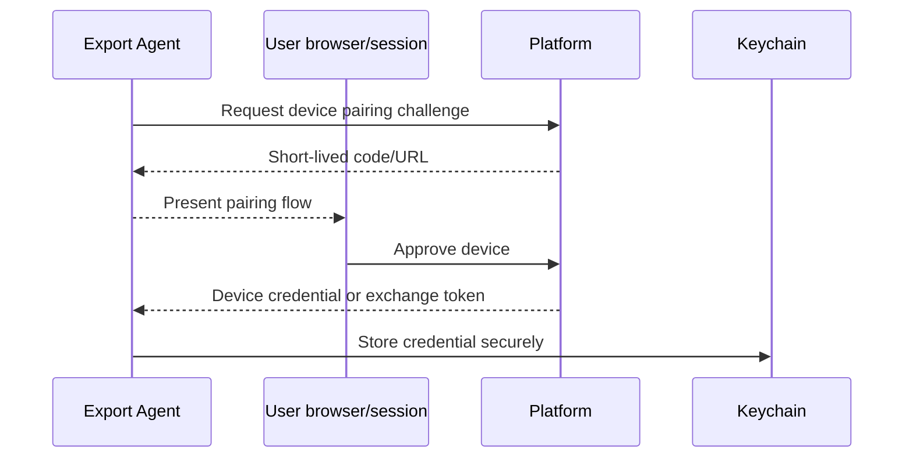

# Ratatoskr Export Agent Architecture

> Status: target architecture. This repository is in architecture bootstrap; the document defines the intended macOS application, background agent, local journal, upload, and security boundaries.

## 1. Purpose

`ratatoskr-export-agent` is a local macOS client that transports official ChatGPT and Claude Data Export archives into Ratatoskr.

It is responsible for:

- monitoring an explicitly selected inbox directory;
- detecting completed archive downloads;
- identifying likely ChatGPT and Claude exports without parsing provider content deeply;
- streaming hash and duplicate detection;
- preserving a local immutable copy;
- durable offline upload to Platform;
- tracking server-side import operations;
- presenting completeness results and backup freshness;
- reminders and local notifications;
- registered-device authentication using Keychain.

It does not log in to ChatGPT or Claude, store provider passwords/cookies, request exports through undocumented endpoints, or parse provider-specific archive schemas. Parsing belongs to `ratatoskr-chatgpt` and `ratatoskr-claude`.

## 2. Architectural position



The client transports archives and displays progress. Provider archive authority remains on the server-side archive service.

## 3. Repository and target structure

```text
ratatoskr-export-agent/
├── App/
│   ├── ExportAgentApp.swift
│   ├── Scenes/
│   └── Commands/
├── Packages/
│   ├── AgentCore/
│   ├── InboxWatcher/
│   ├── ArchiveClassifier/
│   ├── TransferQueue/
│   ├── LocalJournal/
│   ├── DeviceAuth/
│   ├── PlatformClient/
│   ├── Notifications/
│   └── TestSupport/
├── Helper/
│   └── BackgroundAgent/
├── Tests/
├── docs/
└── project configuration
```

The exact Xcode/SwiftPM layout may evolve, but domain, filesystem, network, and UI concerns remain separable and testable.

## 4. Runtime components

### 4.1. Main application

The SwiftUI macOS app provides:

- onboarding and server pairing;
- inbox and archive-directory selection;
- queue and history views;
- import operation progress;
- completeness reports;
- reminder and notification settings;
- diagnostics and manual retry;
- secure device revocation/logout.

### 4.2. Background component

A background helper or launch mechanism performs bounded work when the main window is closed:

- observe selected directory changes;
- resume pending hashing/uploads;
- refresh operation status;
- deliver local notifications.

It must respect macOS lifecycle, sandbox, energy, and distribution constraints. A persistent LaunchAgent is used only when appropriate to the chosen distribution model; otherwise the architecture uses supported app background mechanisms and user-visible launch behavior.

### 4.3. Shared core

The main app and background component share domain and persistence packages rather than duplicating queue logic.

## 5. Local data ownership

The agent owns only local transport state:

```text
device registration metadata
selected directory bookmarks
archive fingerprints
local archive locations
transfer queue items
transfer attempts
server operation references
completeness summaries
reminder state
notification preferences
diagnostic events
```

It does not store normalized conversations, projects, messages, or provider archive database entities.

## 6. Directory access architecture

### 6.1. User-selected locations

The user explicitly selects:

- an inbox directory;
- an optional immutable archive directory.

Sandboxed builds store security-scoped bookmarks and reacquire scoped access only when needed.

The agent does not scan all of `~/Downloads`, browser profiles, Mail data, or unrelated filesystem locations by default.

### 6.2. File observation

The watcher converts filesystem notifications into debounced scan requests. Notifications are hints; the directory journal is authoritative.



A periodic low-frequency reconciliation scan handles missed events.

## 7. Completed-download detection

The agent does not process a file merely because it appears.

A candidate is considered stable only after criteria such as:

- no known temporary-download extension;
- regular file, not symlink/device;
- size and modification time unchanged across a stability interval;
- file can be opened for read;
- archive central directory/container can be inspected safely;
- no active transfer/journal lock;
- size remains under configured policy.

If the file changes after hashing starts, the attempt is invalidated and retried from the beginning.

## 8. Archive classification

Classification is intentionally shallow.

Inputs:

- filename metadata;
- archive container structure;
- small bounded reads of known manifest/JSON filenames;
- provider-specific high-level signatures;
- MIME/container validation.

Outputs:

```text
provider candidate: ChatGPT | Claude | Unknown
confidence
archive fingerprint
observed file metadata
warnings
```

The agent does not normalize conversations or projects. Ambiguous archives can be held for user selection or uploaded as an explicitly selected provider import with warnings.

## 9. Hashing and fingerprinting

### 9.1. Streaming hash

SHA-256 is computed by streaming reads with cancellation and progress. The agent never loads the full archive into memory.

Fingerprint:

```text
sha256
byte size
stable file identity where available
observed modification timestamp
provider classification
```

SHA-256 plus size is the primary duplicate key. Filesystem identity is an optimization, not durable content identity.

### 9.2. Duplicate handling

Possible outcomes:

```text
new archive
already preserved locally
already uploaded and imported
same content under another filename
previous upload incomplete
same hash with inconsistent metadata -> diagnostic review
```

Duplicate detection never deletes user files automatically.

## 10. Local immutable archive

After successful hashing, the agent can preserve the original bytes in a user-selected archive layout.

```text
<archive-root>/
├── chatgpt/YYYY/MM/<sha256>.zip
├── claude/YYYY/MM/<sha256>.zip
└── manifests/<sha256>.json
```

Rules:

- copy to a temporary destination;
- verify destination size/hash;
- atomically rename into final content-addressed path;
- never overwrite different content;
- retain original file unless the user explicitly enables a safe move policy;
- record the local archive manifest in the journal.

The local copy complements server/off-host backup; it is not proof that server import completed.

## 11. Durable journal

A local SQLite or equivalent journal is the source of truth for agent workflow.

Suggested entities:

```text
watched_directories
archive_items
local_copies
transfer_jobs
transfer_attempts
server_operations
completeness_results
reminders
diagnostic_events
```

### 11.1. Archive item state machine

```text
discovered
-> waiting_for_stability
-> hashing
-> classified
-> locally_preserving
-> ready_to_upload
-> uploading
-> uploaded
-> server_importing
-> completed
```

Alternative states:

```text
duplicate
paused
retry_wait
needs_user_input
failed_permanent
cancelled
```

State transitions are transactional. Restarting the app resumes from the last durable state.

## 12. Device authentication

The agent authenticates to Platform as a registered device, not with ChatGPT/Claude credentials.

### 12.1. Pairing



### 12.2. Credential rules

- store device secrets in Keychain;
- bind tokens to server origin and device ID;
- rotate and revoke credentials;
- use short-lived access tokens where practical;
- never store credentials in preferences, logs, crash reports, or journal plaintext;
- validate TLS and configured server identity;
- require explicit approval when changing server origin.

## 13. Upload architecture

### 13.1. Upload request

The agent creates an import operation using:

- provider classification;
- archive hash and size;
- local observed timestamps;
- client/device metadata;
- idempotency key;
- no provider credentials.

Platform returns an operation and upload strategy, such as direct server upload or a short-lived BlobStore upload URL.

### 13.2. Resumable transfer

Large archives require resumable or restart-safe transfer.

```text
reserve server import
-> obtain upload session
-> stream chunks with bounded memory
-> persist acknowledged offset/parts
-> finalize upload with hash
-> server verifies bytes
-> start provider import
```

The exact multipart protocol is versioned. A process crash or network loss resumes without creating duplicate imports.

### 13.3. Idempotency

A stable idempotency key derives from device, archive hash, provider, and logical import intent. Retrying returns the same operation when the payload matches.

## 14. Offline queue and scheduling

The agent is offline-first.

Queue policy considers:

- network reachability;
- metered/expensive connection setting;
- battery/power state if relevant;
- user pause;
- server backoff/`Retry-After`;
- upload concurrency;
- archive priority and age.

Backoff is exponential with jitter and bounded. Permanent validation/auth failures require user action rather than infinite retry.

## 15. Operation tracking

After upload, the server performs provider-specific parsing and reconciliation.

The agent observes:

```text
accepted
queued
running
succeeded
partially_succeeded
failed
cancelled
```

Progress can use SSE when the app is active and polling/background refresh otherwise.

The local item remains `server_importing` until a terminal operation result is durably stored.

## 16. Completeness presentation

The agent displays server-produced summaries, for example:

```text
projects discovered
conversations discovered
messages discovered
attachments stored/missing
unknown record variants
completeness classification
warnings
```

The agent does not independently reinterpret server parser details. It stores a bounded summary plus operation/report reference.

A successful upload and a complete archive import are separate statuses.

## 17. Backup freshness and reminders

The agent tracks last successful snapshot per provider/account.

Freshness states:

```text
current
due soon
overdue
never backed up
import incomplete
```

Reminders can be monthly, weekly, or user-defined. They remind the user to request/download an official export; they do not automate provider login.

Notifications may include:

- new export detected;
- upload completed;
- import completed/partial/failed;
- export link likely expiring, when inferred from user-provided email/metadata through an approved integration;
- backup overdue.

## 18. User interface architecture

Primary views:

```text
Dashboard
  backup freshness by provider
  pending/active jobs

Inbox
  discovered archives
  classification and warnings

History
  local archive and server import results

Import detail
  hashing/upload/progress/completeness

Settings
  server, directories, reminders, network, notifications

Diagnostics
  sanitized state and retry tools
```

The UI observes shared durable state rather than maintaining independent workflow state.

## 19. macOS lifecycle and background execution

The architecture separates durable work from process lifetime.

- filesystem events trigger journal work, not long in-memory chains;
- hashing/upload tasks are cancellable and checkpointed;
- background execution uses supported macOS mechanisms appropriate to distribution;
- the agent avoids busy polling and excessive wakeups;
- UI termination does not corrupt queue state;
- helper and app coordinate through a narrow shared journal/service interface;
- upgrades preserve journal migrations and resumable jobs.

## 20. Filesystem safety

- only regular files inside selected scopes are processed;
- symlinks are rejected or resolved under strict scope policy;
- path traversal inside archives is inspected but never extracted by the agent;
- file changes invalidate active hashing/upload;
- local archive destination uses content-derived names;
- copy/rename operations are atomic where supported;
- disk free space is checked before local preservation;
- cleanup never removes original downloads or verified archives without explicit user policy.

## 21. Privacy architecture

The agent sees raw private exports and therefore minimizes exposure.

- no archive content, conversation text, filenames, or provider data in analytics;
- logs use internal item IDs, byte counts, hashes only when safe, and error classifications;
- raw archives are never attached to crash reports;
- local journal stores minimum metadata;
- UI thumbnails/previews are avoided unless explicitly implemented with safe parsing;
- temporary files use protected locations and are removed after use;
- diagnostics export is sanitized and user-reviewed;
- server upload uses TLS and authenticated requests.

## 22. Commands and API contracts

Representative Platform calls:

```text
POST /v2/devices/pair
POST /v2/ai-archives/imports
POST /v2/ai-archives/imports/{id}/upload-session
POST /v2/ai-archives/imports/{id}/complete-upload
GET  /v2/operations/{id}
GET  /v2/operations/{id}/events
GET  /v2/ai-archives/reports/{id}
```

The public API is defined by `ratatoskr-platform` and `ratatoskr-contracts`. The agent uses a generated or strongly typed client and does not call ChatGPT/Claude services directly.

## 23. Failure model

### Transient

- file temporarily locked or incomplete;
- network unavailable;
- server timeout/throttling;
- background execution interrupted;
- local archive destination temporarily unavailable.

### User-action required

- unknown/ambiguous provider archive;
- device authorization expired or revoked;
- server origin changed;
- inbox/archive directory permission lost;
- disk full;
- archive exceeds configured policy.

### Permanent for one item

- file disappeared before preservation;
- hash changes repeatedly;
- invalid archive container;
- server rejects provider/type definitively.

Failures preserve journal state and original files. Retrying is explicit and idempotent.

## 24. Security boundaries

- No provider passwords, MFA secrets, browser cookies, or undocumented session tokens.
- No automated ChatGPT/Claude login or export request.
- Keychain stores only Ratatoskr device credentials.
- Directory access is user-selected and scoped.
- Archives and filenames are hostile input.
- Upload destinations are accepted only from the configured trusted Platform origin.
- Redirects do not silently move uploads to arbitrary origins.
- Logs/crashes exclude archive content and credentials.
- Background helper has no broader privileges than required.
- Updates, code signing, entitlements, and notarization follow the selected macOS distribution model.

## 25. Observability and diagnostics

Local diagnostic counters:

```text
files_discovered
files_waiting_for_stability
hash_duration
archives_classified
classification_unknown
local_copy_duration
upload_bytes
upload_duration
upload_retries
operation_age
imports_completed/partial/failed
last_successful_backup_age
journal_migration_failures
```

Diagnostics are local-first and sanitized. Optional server telemetry sends only bounded operational metadata under user policy.

## 26. Testing architecture

### Unit

- stable-file detection;
- provider classification;
- hash/fingerprint and duplicate logic;
- journal state transitions;
- retry/backoff decisions;
- freshness/reminder calculation;
- operation result mapping.

### Filesystem integration

- atomic/incremental download simulations;
- file mutation during hashing;
- symlink and permission cases;
- disk-full/local-copy recovery;
- watcher event loss followed by reconciliation scan;
- security-scoped bookmark renewal.

### Network integration

- pairing and token rotation;
- resumable upload interruption;
- server idempotency;
- TLS/origin validation;
- `Retry-After` and offline queue;
- SSE reconnect/polling fallback.

### Persistence

- journal migrations;
- process restart at every workflow state;
- duplicate archives under different names;
- corrupted journal recovery strategy.

### Privacy/security

- assert no content in logs;
- Keychain access failures;
- malicious filenames and archives;
- untrusted upload URL rejection;
- sanitized diagnostics.

### Workspace end-to-end

- detect synthetic ChatGPT/Claude export;
- preserve local copy;
- upload through Platform;
- import in owning archive service;
- receive completeness report;
- retry without duplicate server import.

## 27. Distribution architecture

Potential distribution profiles:

```text
Developer/self-hosted signed build
Direct-distribution notarized app
Mac App Store sandboxed app, if feature constraints allow
```

The chosen profile determines helper, sandbox, directory bookmark, update, and background-execution design. Distribution-specific code stays behind platform adapters so core workflow remains testable.

## 28. Architectural invariants

1. The agent transports official user-downloaded archives; it does not acquire them through provider login automation.
2. Provider-specific parsing belongs to ChatGPT/Claude services.
3. Directory access is explicit and narrow.
4. A file is processed only after stability checks.
5. Hashing and upload are streaming and bounded.
6. Original bytes are preserved before optional file movement.
7. Queue and workflow state are durable across process restarts.
8. Device credentials live in Keychain.
9. Upload and server import are separate states.
10. Duplicate retries are idempotent.
11. Archive content never enters logs, analytics, or crash reports.
12. The agent communicates only with Platform public APIs.
13. User files are never deleted automatically without explicit policy.
14. Background behavior respects supported macOS lifecycle and distribution constraints.

## 29. Evolution

Initial milestones:

1. SwiftUI shell, server pairing, Keychain, and local journal.
2. User-selected inbox and reconciliation scan.
3. Stable-file detection, streaming hash, and provider classification.
4. Local immutable archive copy.
5. Platform import reservation and resumable upload.
6. Operation tracking and completeness UI.
7. Background resume and notifications.
8. Reminder/freshness model.
9. Signed/notarized distribution and migration tests.
10. Diagnostics, recovery runbooks, and privacy audit.

Changes to provider-login policy, filesystem scope, device credential model, or automatic deletion require ADRs and coordinated workspace changesets.
